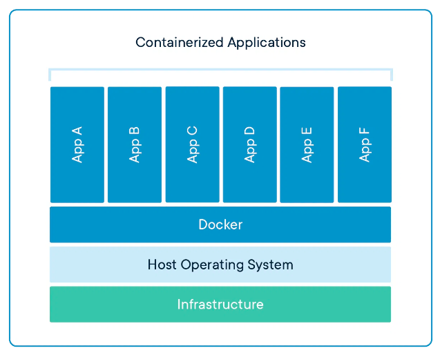
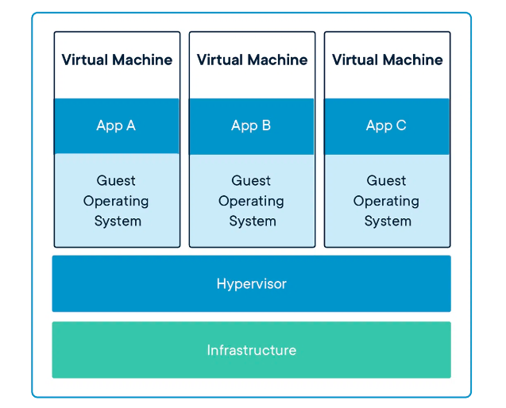

# Estudo Docker

## Background

#### Desvantagens servidores físicos

Utilizar um servidor físico separado para cada serviço de um sistema gera problemas como:
* Custo de luz
* Custo de rede
* Alto tempo de ociosidade da máquinas

#### Desvantagens máquinas virtuais

A solução para esses problemas foi a virtualização dos recursos físicos, reduzindo assim os custos de luz e rede, já que não teremos mais vários servidores físicos, e não teremos mais ociosidade do hardware.

Porém ainda assim VM's ficam para trás nos quesitos:

* Custo de manutenção/atualização do sistema operacional
* Custo de hardware que cada VM's precisa ter
* Manter programas e ambiente de desenvolvimento

## Containers

Um container funcionará junto com nosso sistema operacional base e dentro dele funcionará a nossa aplicação, ou seja, a aplicação será executada dentro dele. Criamos um container para cada aplicação e esses containers vão dividir as funcionalidades do sistema operacional. Um container também tem como definição de ser uma instanciação de uma imagem do docker, que como analogia, uma imagem pode ser associada a uma aplicação.

Não temos mais um sistema operacional para cada aplicação, já que agora as aplicações estão dividindo o mesmo sistema operacional, que está em cima do nosso hardware. Os próprios containers terão a lógica que se encarregará dessa divisão.

Assim, com somente um sistema operacional, reduzimos os custos de manutenção e de infraestrutura como um todo.

Algumas vantagens de containers:

* Melhor controle do uso dos recursos do sistema operacional
* Agilidade na hora de criar e remover aplicações
* Maior facilidade na hora de trabalhar com diferentes versões de bibliotecas e linguagens
* Fácil disponibilização de ambiente de desenvolvimento. O docker criou uma padronização dos containers, para que assim ele possa ser portável
* Um container divide funcionalidades do sistema operacional(de um único SO). Isso ajuda na eficiência dos servidores e também nos custos de licenciamento
* Ideal para usar com a arquitetura de micro serviços
* Ideal um deploy mais rápido

## Docker containers vs. máquinas virtuais

Os dois compartilham do mesmo conceito de isolação e alocação de benefícios, porém diferem no conceito de virtualização.

### Containers

É uma abstração da camada de aplicação que empacota o código e suas dependências tudo junto. Eles rodam na mesma máquina e compatilham do mesmo sistema operacional ao invés do hardware(que é usado nas VMs). Cada um roda um processo isolado. Containers usam bem menos espaço do que as VMs. Containers são mais portáteis e eficientes.



### Máquina virtuais

São uma abstração do hardware físico que transforma um servidor em muitos outros servidores. Quando falamos em abstração, estamos falando de memória RAM, HD, processadores, etc... Geralmente rodam em cima de uma camada chamada "Hypervisor" que permite múltiplas VMs(máquinas virtuais) rodar em uma única máquina. Cada VM tem uma cópia inteira do sistema operacional, a aplicação, e os binários/bibliotecas necessárias - fazendo com que isso ocupe GBs em uma única imagem. As VMs também podem ser mais lentas para iniciar.




## Tecnologias do Docker

* **Docker Engine**: A plataforma que segura os containers, fazendo o intermédio entre com o sistema operacional
* **Docker Compose**: Um jeito fácil de definir e orquestrar múltiplos containers
* **Docker Swarm**: Uma ferramenta para colocar múltiplos docker engines para trabalharem juntos em um cluster
* **Docker Hub**: Um repositório com mais de 250 mil imagens diferentes para os nossos containers
* **Docker Machine**: Uma ferramenta que nos permite gerenciar o Docker em um host virtual

## Principais comandos Docker

* `docker` lista todos comandos disponíveis
* `docker run NOME_DA_IMAGEM` ou `docker container run NOME_DA_IMAGEM` cria um container com a respectiva imagem passada como parâmetro.
* `docker run --network my_net -v $(pwd):/workspace -it -d -p 8081:80 -n nome_container NOME_DA_IMAGEM` cria um container com os seguintes parâmetros:
  * `--network` "sobe" o container da rede **my_net**
  * `-v` cria volume para salvar o conteúdo do container na máquina local, no caso salvando a **/workspace** na minha pasta local **pwd**. O **$(COMANDO)** serve para executar uma comando de terminal
  * `-it` inicia com container em modo iterativo
  * `-d` ou `--detach` não trava o terminal
  * `-p 8081:80` ou `--publish 8081:80` criar uma endereço localhost no porta **8081** para o nginx que escuta pela porta  **80** no container. Uma alternativa é usa o `-P` onde gera uma porta dinâmica automaticamente
  * `--name nome_container` renomeia o container para  **nome_container**
* `docker run NOME_DA_IMAGEM:NOME_DA_VERSAO` cria um container com uma versão especifica
* `docker stop CONTAINER_ID` para um container que está rodando atualmente
* `docker stop -t 0 $(docker ps -q)` para todos containers sem tempo de espera
* `docker start CONTAINER_ID` inicia um container que já foi baixado
* `docker ps` ou `docker container ls` lista todos containers ativos
* `docker container ls -a` lista todos containers ativos e não ativos
* `docker container rm CONTAINER_ID` remove um container pelo id
* `docker rmi NOME_DA_IMAGEM`
* `docker container inspect CONTAINER_ID` detalhes da configuração do container
* `docker container top CONTAINER_ID` mostra processos do CONTAINER_ID
* `docker container stats` mostra status de usos de todos containers
* `docker container attach CONTAINER_ID` volta para o modo iterativo do console do container
* `docker container exec CONTAINER_ID COMANDO` executa um comando quando um container inicializado
* `docker exec -it CONTAINER_ID bash` entra no console de um container já iniciado
* `docker container rename NOME_ATUAL_CONTAINER NOVO_NOME_CONTAINER` altera o nome do container
* `docker container commit -m "MENSAGEM" CONTAINER_ID` permite gerar nova imagem apartir de outro container modificado
* `docker image history CONTAINER_ID`
* `docker port CONTAINER_NAME PORT`
* `docker image inspect --format '{{.Config.ExposedPorts}}' IMAGE_ID`
* `docker network inspect NETWORK_ID`
* `docker network create NOME_NETWORK`
* `docker connect/disconnect NOME_NETWORK CONTAINER_NAME`

## Dockerfile

É um arquivo de nome igual ao título onde ficará a "receita" para a criação de uma imagem do zero.

Por padrão um arquivo **Dockerfile** é seguido de um **COMANDO** e seus **PARAMETROS**. Todos os comandos são non-casesentive, mas por boa prática a palavra do comando é sempre uppercase: **COMANDO [parametros]**

Também por padrão quando existe mais de uma imagem é de costume renomear os containers para NOME_DA_IMAGEM.dockerfile. Exemplo **node.dockerfile** e ou **nginx.dockerfile**

Exemplo de Dockerfile:

```
FROM       ubuntu:16.04
LABEL maintainer="Lucas Fernandes"

RUN apt-get update

RUN apt-get install -y openssh-server
RUN mkdir /var/run/sshd

RUN echo 'root:root' |chpasswd

RUN sed -ri 's/^PermitRootLogin\s+.*/PermitRootLogin yes/' /etc/ssh/sshd_config
RUN sed -ri 's/UsePAM yes/#UsePAM yes/g' /etc/ssh/sshd_config

EXPOSE 22
EXPOSE 3000

CMD    ["/usr/sbin/sshd", "-D"]
```

### Legenda

`FROM` usa uma imagem como base da nova imagem a ser criada

`RUN` faz com que comandos sejam executados antes de qualquer outro input. serve geralmente para adicionar complementos(apps, dev libs, etc..) na construção da imagem base

`EXPOSE` determina que uma porta ficará em estado de listen para comunicação

`CMD` determina um comando que será rodado internamente em um container no momento em que ele será levantado

### Outros comandos do Dockerfile

`WORKDIR` diz qual o diretório que irá trabalhar

`COPY` copia arquivos para dentro do container

`ADD` copia arquivos para dentro do container, porém tem outras opções avançadas, exemplo, de copiar de um URL para dentro do container

`ENV` possibilita a criação de variáveis que ficarão disponível para referenciar no **Dockerfile**

`ENTRYPOINT` realiza um comando ao subir e iniciar o container

## Arquvio .dockerignore

Serve para ignorar certos arquivos para no momento do build esses arquivos não sejam passados para o container.

## Build da nova imagem

Após criar o **Dockerfile** basta rodar o comando para formar a nova imagem:

`docker build -t MEU_USUARIO/NOME_DA_IMAGEM:TAG_DA_IMAGEM CAMINHO_DOCKERFILE`

## Upando nova imagem para Docker hub

Use o comando para:
`docker login`
`docker tag ID_DA_IMAGEM NOME_DE_USUARIO/NOME_DA_IMAGEM`
`docker push NOME_DE_USUARIO/NOME_DA_IMAGEM`

## Docker Compose

Com o `docker-compose` é possível definir e rodar múltiplos containers com suas aplicações. Com o Docker compose é usado um arquivo **.yml** que irá conter todas as configurações dos serviços.

O `docker-compose` é composto basicamente de três processos:

  1. **Dockerfile**: responsável por definir o ambiente da aplicação, como por exemplo, linguagem usado, ferramentas, versões, comandos de execução após inicialização do container, e etc.
  2. **docker-compose.yml**: o trabalho desse arquivo é definir os serviços que irão rodar com a aplicação, assim como mapear volumes, portas e networks do container.
  3. Após isso é execudado o comando `docker-compose up`

Exemplo de docker-compose.yml:

```yaml
version: '3'

services:
  cloud9:
    image: sapk/cloud9
    volumes:
      - .:/workspace
    ports:
      - "8181:8181"
      # Gera uma porta dinâmica pra porta 3000
      - "3000"
    command: --auth username:password
```

## Alguns comandos do docker-compose

* `docker-compose up -d` acha o arquivo `docker-compose.yml` e "levanta" os container especificados no arquivo compose. A opção `-d` ou `--detach` não trava o terminal.
* `docker-compose -f NOME_DO_DOCKER_COMPOSE up` quando o arquivo compose não é nomeado exatamente como `docker-compose.yml`, vc terá que especificar com a opção `-f` seguido do nome dado ao arquivo compose
* `docker-compose up --scale NOME_SERVICO=NUM_INSTANCIAS` faz com que várias instancias de um serviço seja "levantado"
* `docker-compose run -d -p 3005:300 -p 2222:22 rails` faz alterações em um container já em execução sem necessidade de alterar o arquivo `docker-compose.yml`
* `docker-compose up --build` constroí/reconstroí as imagens e em seguida "levanta" os containers especificados nos `docker-compose.yml` 

## Dockerizando uma aplicação rails

* [Rails samples do site docs.docker](https://docs.docker.com/samples/rails/)
* [Quickstart: Compose and Rails](https://github.com/docker/awesome-compose/tree/master/official-documentation-samples/rails/)

## Referências

* [What is a Container?](https://www.docker.com/resources/what-container/)
* [Youtube - Containers vs VMs](https://www.youtube.com/watch?v=cjXI-yxqGTI&ab_channel=IBMTechnology)
* [Youtube - Virtual Machina (VM) vs Docker](https://www.youtube.com/watch?v=a1M_thDTqmU&ab_channel=IBMTechnology)
